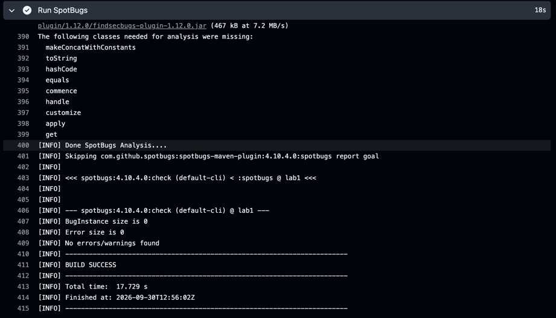
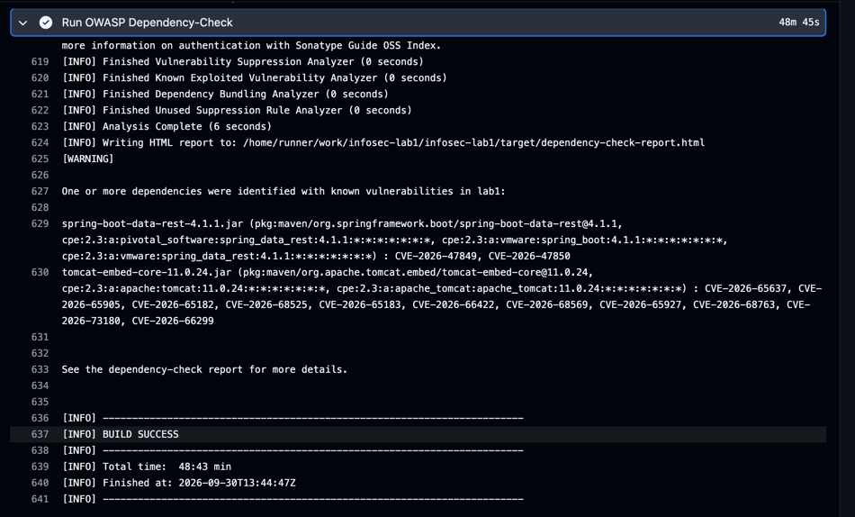

# Информационная безопасность

## Лабораторная работа №1

### Стек

* Java 21
* Spring Boot
* Maven
* Spring Security
* Spring Data JPA / Hibernate
* PostgreSQL
* JWT (JJWT)
* BCrypt
* Apache Commons Text
* GitHub Actions
* SpotBugs (SAST)
* OWASP Dependency-Check (SCA)

### Запуск

Для запуска приложения необходимо установить Java 21, Maven и PostgreSQL.

Настроить переменные окружения:

```bash
export DB_PASSWORD=postgres
export JWT_SECRET="your-long-random-secret-key-at-least-32-bytes"
export JWT_EXPIRATION=3600000
```

Запустить приложение:

```bash
./mvnw spring-boot:run
```

После запуска API доступно по адресу:

```text
http://localhost:8080
```

База создастся сама благодаря JPA

### Описание API

#### `POST /auth/register`

Регистрация нового пользователя.

Метод не требует JWT-токена.

Тело запроса:

```json
{
  "username": "student",
  "password": "password123"
}
```

При успешной регистрации возвращается:

```text
HTTP 201 Created
```

Пароль перед сохранением в базу данных хешируется с помощью BCrypt.

---

#### `POST /auth/login`

Аутентификация пользователя.

Метод не требует JWT-токена.

Тело запроса:

```json
{
  "username": "student",
  "password": "password123"
}
```

При успешной аутентификации сервер возвращает JWT:

```json
{
  "token": "eyJhbGciOiJIUzI1NiJ9..."
}
```

Полученный токен используется для доступа к защищённым эндпоинтам.

---

#### `GET /api/data`

Получение списка сохранённых данных.

Эндпоинт защищён JWT-аутентификацией.

Необходимо передать токен в заголовке:

```text
Authorization: Bearer <token>
```

Пример:

```bash
curl -i http://localhost:8080/api/data \
  -H "Authorization: Bearer <token>"
```

При отсутствии или некорректности JWT возвращается:

```text
HTTP 401 Unauthorized
```

При успешной аутентификации возвращается список записей:

```json
[
  {
    "id": 1,
    "title": "Test",
    "content": "Hello"
  }
]
```

---

#### `POST /api/data`

Создание новой записи.

Эндпоинт доступен только аутентифицированным пользователям.

Тело запроса:

```json
{
  "title": "Моя запись",
  "content": "Текст записи"
}
```

JWT передаётся в заголовке:

```text
Authorization: Bearer <token>
```

Пример:

```bash
curl -i -X POST http://localhost:8080/api/data \
  -H "Content-Type: application/json" \
  -H "Authorization: Bearer <token>" \
  -d '{
    "title": "Моя запись",
    "content": "Текст записи"
  }'
```

### Описание реализованных мер защиты

#### Защита от SQL Injection

Для работы с базой данных используется Spring Data JPA / Hibernate.

Запросы к базе данных выполняются через `JpaRepository` и методы репозитория. Пользовательские значения не добавляются в SQL-запросы посредством конкатенации строк.

Например, поиск пользователя выполняется через:

```java
userRepository.findByUsername(username)
```

а сохранение данных:

```java
dataRepository.save(data)
```

Spring Data JPA и Hibernate формируют параметризованные SQL-запросы самостоятельно.

Таким образом, пользовательский ввод не интерпретируется как часть SQL-кода.

Например, попытка использовать SQL Injection в поле username:

```text
' OR '1'='1
```

не приводит к изменению структуры SQL-запроса и не позволяет обойти аутентификацию.

---

#### Защита от XSS

Для защиты от XSS пользовательские данные экранируются перед формированием ответа API.

Для этого используется Apache Commons Text:

```java
StringEscapeUtils.escapeHtml4(data.getAuthor())
StringEscapeUtils.escapeHtml4(data.getText())
```

Например, если пользователь отправляет:

```text
<script>alert(1)</script>
```

то в API-ответе специальные HTML-символы преобразуются:

```text
&lt;script&gt;alert(1)&lt;/script&gt;
```

Таким образом, пользовательский ввод не возвращается в ответе как исполняемый HTML-код.

Экранирование выполняется при формировании ответа, а исходные данные в базе данных не изменяются.

---

#### JWT-аутентификация

Для аутентификации используется JWT.

После успешного выполнения:

```text
POST /auth/login
```

сервер создаёт JWT, содержащий идентификатор пользователя (`username`) и время действия токена.

Пример создания токена:

```java
Jwts.builder()
        .subject(username)
        .issuedAt(now)
        .expiration(expiry)
        .signWith(secretKey)
        .compact();
```

Для защищённых эндпоинтов клиент передаёт токен:

```text
Authorization: Bearer <token>
```

`JwtAuthenticationFilter` извлекает токен из заголовка, проверяет его подпись и срок действия, после чего устанавливает аутентифицированного пользователя в `SecurityContext`.

Защита эндпоинтов настроена следующим образом:

```java
.authorizeHttpRequests(auth -> auth
        .requestMatchers("/auth/login", "/auth/register").permitAll()
        .anyRequest().authenticated()
)
```

Таким образом:

* `/auth/register` — доступен без JWT;
* `/auth/login` — доступен без JWT;
* `/api/data` — требует JWT.

При отсутствии или некорректности JWT API возвращает:

```text
401 Unauthorized
```

Сессии на сервере не используются:

```java
.sessionManagement(session ->
        session.sessionCreationPolicy(
                SessionCreationPolicy.STATELESS
        )
)
```

---

#### Хеширование паролей

Пароли пользователей не сохраняются в базе данных в открытом виде.

Перед сохранением пароль обрабатывается через `BCryptPasswordEncoder`:

```java
user.setPassword(passwordEncoder.encode(request.password()));
```

При входе введённый пароль сравнивается с сохранённым BCrypt-хешем:

```java
passwordEncoder.matches(
        request.password(),
        user.getPassword()
)
```

Таким образом, исходный пароль пользователя не хранится в базе данных.

---

#### Валидация входных данных

Для DTO используются Jakarta Bean Validation.

Например:

```java
@NotBlank
@Size(min = 3, max = 50)
String username
```

и:

```java
@NotBlank
@Size(min = 8, max = 100)
String password
```

Это позволяет отклонять некорректные входные данные до их обработки бизнес-логикой.

---

#### Stateless API

Spring Security настроен в режиме:

```java
SessionCreationPolicy.STATELESS
```

Сервер не хранит пользовательскую сессию. Каждый защищённый запрос должен содержать JWT в заголовке:

```text
Authorization: Bearer <token>
```

Для REST API с JWT отключена CSRF-защита Spring Security:

```java
.csrf(AbstractHttpConfigurer::disable)
```

Это связано с тем, что приложение использует stateless Bearer-аутентификацию вместо cookie-based сессий.

### CI/CD и автоматический анализ безопасности

Для проекта используется GitHub Actions.

Pipeline запускается при:

* `push` в ветки `main` и `master`;
* `pull_request`.

Основные этапы pipeline:

```text
Checkout
    ↓
JDK 21
    ↓
Build + Tests
    ↓
SpotBugs (SAST)
    ↓
OWASP Dependency-Check (SCA)
    ↓
Загрузка отчётов
```

#### SAST — SpotBugs

Для статического анализа исходного кода используется SpotBugs.

Запуск:

```bash
mvn --batch-mode compile spotbugs:check
```

SpotBugs анализирует скомпилированный Java-код и позволяет обнаруживать потенциальные ошибки и небезопасные конструкции.

При обнаружении критических проблем pipeline может завершиться с ошибкой.

Отчёт SpotBugs сохраняется как GitHub Actions Artifact.

Скриншот:

[SpotBugs](./screenshots/spotbugs.png)

---

#### SCA — OWASP Dependency-Check

Для анализа сторонних зависимостей используется OWASP Dependency-Check.

Он проверяет зависимости проекта на наличие известных уязвимостей из базы NVD.

Запуск выполняется в GitHub Actions:

```bash
mvn --batch-mode \
  org.owasp:dependency-check-maven:check \
  -DnvdApiKeyEnvironmentVariable=NVD_API_KEY
```

API-ключ NVD хранится в GitHub Secrets и не находится в исходном коде репозитория.

Отчёт Dependency-Check сохраняется как GitHub Actions Artifact.

Скриншот:

[Dependency-Check](./screenshots/dependency-check.png)

### Отчёты из CI/CD

В разделе **Actions** репозитория можно посмотреть результаты выполнения pipeline.

#### SpotBugs — SAST



#### OWASP Dependency-Check — SCA



Отчёты также доступны в разделе **Artifacts** соответствующего запуска GitHub Actions.

### Проверка API

Пример последовательности проверки:

1. Зарегистрировать пользователя:

```bash
curl -i -X POST http://localhost:8080/auth/register \
  -H "Content-Type: application/json" \
  -d '{"username":"student","password":"password123"}'
```

2. Выполнить вход:

```bash
curl -i -X POST http://localhost:8080/auth/login \
  -H "Content-Type: application/json" \
  -d '{"username":"student","password":"password123"}'
```

3. Получить данные без токена:

```bash
curl -i http://localhost:8080/api/data
```

Ожидаемый результат:

```text
401 Unauthorized
```

4. Получить данные с JWT:

```bash
curl -i http://localhost:8080/api/data \
  -H "Authorization: Bearer <token>"
```

Ожидаемый результат:

```text
200 OK
```

5. Проверить защиту от XSS:

```bash
curl -i -X POST http://localhost:8080/api/data \
  -H "Content-Type: application/json" \
  -H "Authorization: Bearer <token>" \
  -d '{
    "title": "<script>alert(1)</script>",
    "content": ""
  }'
```

Пользовательские HTML-конструкции должны быть экранированы при формировании ответа API.
